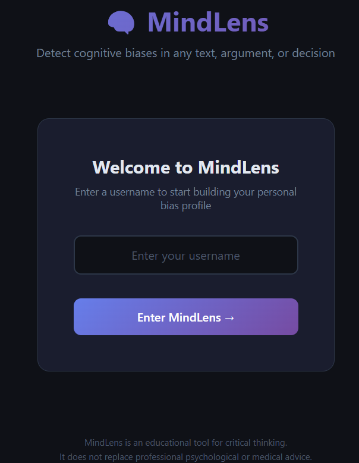
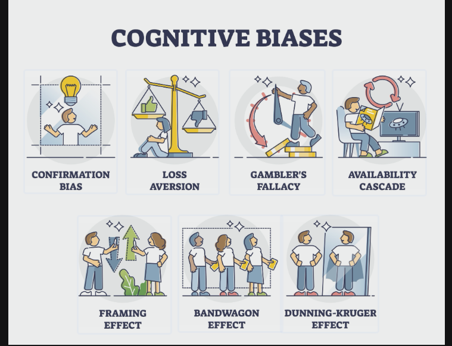

# 🧠 MindLens — Cognitive Bias Detector

<p align="center">
  
</p>

An advanced AI-powered critical thinking tool that identifies psychological shortcuts and logical fallacies in text. **MindLens** helps users deconstruct their decision-making process by quantifying the quality of their reasoning.

🚀 **[Live Demo](https://mindlens-app.onrender.com)**

---

### 💡 Features

* **Multidimensional Bias Detection:** Identifies 20+ types of cognitive biases (Sunk Cost, FOMO, Confirmation Bias, etc.) using Gemini 1.5 Flash.
* **Reasoning Quality Score:** Provides a quantitative 1-10 score based on objectivity and logical consistency.
* **Cognitive DNA Profile:** Aggregates your history to show your "most frequent" biases and provides tailored improvement tips.
* **Global Benchmarking:** Real-time comparison showing how your objectivity compares to the average MindLens user.

### 🛠️ Tech Stack

* **Backend:** FastAPI (Python)
* **AI:** Google Gemini Pro API
* **Database:** PostgreSQL (Production) / SQLAlchemy ORM
* **Frontend:** Modern Dark UI (HTML5, CSS3, JavaScript)

---

### 📸 How It Works

<p align="center">
  
</p>

1. **Input:** Paste any argument, investment pitch, or decision-making text.
2. **Analyze:** The AI engine scans for emotional triggers and logical gaps.

<p align="center">
  
</p>

3. **Growth:** Visit the **Profile** tab to see your long-term cognitive patterns.

<p align="center">
  
</p>

---

### 📦 Installation

```bash
### 📦 Installation

# 1. Clone the repository
git clone https://github.com/Ayushi-324/MindLens.git
cd MindLens

# 2. Install dependencies
pip install -r requirements.txt

# 3. Set up Environment Variables (.env)
GEMINI_API_KEY="your_api_key_here"
DATABASE_URL="sqlite:///./mindlens.db" 

# 4. Run the application
uvicorn main:app --reload

### 📁 Project Structure

MindLens/
├── main.py           # FastAPI server & AI logic
├── database.py       # SQLAlchemy models & Database connection
├── index.html        # Single-page Application UI
├── requirements.txt  # Python dependencies
└── .gitignore        # Keeps API keys and DB files private

### 🌐 API Endpoints

| Method | Endpoint | Description |
| :--- | :--- | :--- |
| **POST** | `/analyze` | Submits text for bias detection and scoring |
| **GET** | `/history/{user}` | Retrieves past analysis for a specific user |
| **GET** | `/profile/{user}` | Returns the "Cognitive DNA" stats for a user |
| **GET** | `/global-insights` | Aggregates anonymized data for all users |
| **GET** | `/compare/{user}` | Calculates the "You vs Global" comparison |

---
**Developed by [Ayushi Tyagi](https://github.com/Ayushi-324)** 🚀
